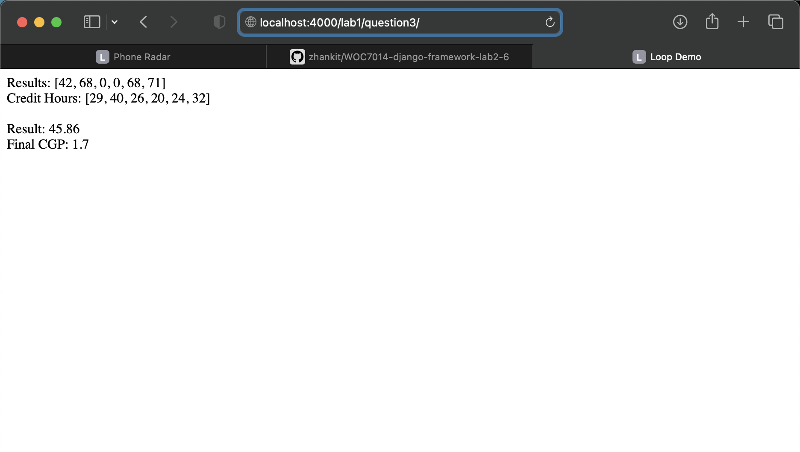

# WOC7014-django-framework-lab1
Framework-based software design and development

# Pre-requite
- Docker

# Installation
`docker-compose up --build`

# URL
`http://localhost:4000`

# Screenshots

## HomePage

## Question1

## Question2

## Question3

